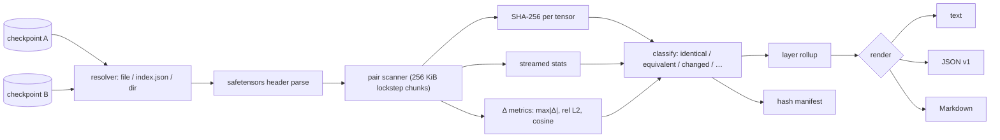

# layerdiff

[English](README.md) | [中文](README.zh.md) | [日本語](README.ja.md)

[](LICENSE) [](go.mod) [](CHANGELOG.md)  [](CONTRIBUTING.md)

**layerdiff：2 つのモデル checkpoint をテンソル単位で比較するオープンソース・ゼロ依存 CLI —— ストリーミングハッシュ、数値統計、変更レイヤーレポートを、モデルを一切ロードせずに。**


```bash
git clone https://github.com/JaydenCJ/layerdiff && cd layerdiff
go build -o layerdiff ./cmd/layerdiff    # single static binary, stdlib only
```

> プレリリース：v0.1.0 はまだどのパッケージレジストリにも公開していません。上記の手順でソースからビルドしてください（Go ≥1.22 で動作）。

## なぜ layerdiff？

「ファインチューニングは実際どこを触ったのか？」に即答できる手段は今のところありません。`sha256sum` や `diff` はファイルレベル止まり：14 GB の checkpoint が*変わったこと*は分かっても、*どこが変わったか*は永遠に分かりません。正直な代替案は、両方の checkpoint を `torch.load` する使い捨て Python スクリプト——GB 級のフレームワークをインストールし、モデル 2 つ分を RAM に載せ、モデルファミリーごとに書き直す 20 行のテンソル帳簿付きです。layerdiff は safetensors のヘッダーを直接読み、各テンソルを固定 256 KiB バッファに流しながら、テンソル毎の SHA-256・統計・要素毎の差分メトリクスを片側 1 パスで計算します——シャード化された 70B のペアでも、ノート PC 上で定数メモリ、フレームワーク不要で比較が終わります。得られるのは研究者やモデルマージ愛好家が本当に欲しいレポート：どのレイヤーがどれだけ変わり、何が追加・削除されたか。さらに `--atol`/`--rtol` が本物のファインチューニングと変換ノイズを切り分けます。

| | layerdiff | sha256sum / diff | 使い捨て PyTorch スクリプト | モデルハブのファイル画面 |
|---|---|---|---|---|
| テンソル単位の同一性（テンソル毎ハッシュ） | ✅ | ❌ ファイル全体のみ | ✅ 手書き | ❌ ファイルレベル |
| 変更レイヤーの集約 | ✅ | ❌ | ❌ 自作 | ❌ |
| 数値 Δ メトリクス（max\|Δ\|・相対 L2・コサイン） | ✅ | ❌ | ✅ 書けばの話 | ❌ |
| 必要メモリ | 定数（約 0.5 MiB のバッファ） | 定数 | モデル 2 つ分の RAM | 対象外 |
| シャード `*.index.json` の追跡 | ✅ | ❌ | 手動 | ✅ |
| いま撮って後で監査（ハッシュマニフェスト） | ✅ | ❌ | ❌ | ❌ |
| 許容誤差つき終了コードゲート | ✅ | ✅ バイト単位のみ | ❌ | ❌ |
| ランタイム依存 | 0（静的バイナリ） | 0（標準搭載） | Python + フレームワーク | 対象外（ホスト型サービス） |

<sub>依存数の確認日は 2026-07-12：layerdiff は Go 標準ライブラリのみを import。最小構成の PyTorch でも、最初のテンソルを読む前にディスクを数 GiB 消費します。</sub>

## 機能

- **定数メモリのストリーミング** —— 各テンソルは固定 256 KiB バッファを流れ、ハッシュ・統計・Δ メトリクスを片側 1 パスで畳み込むため、checkpoint のサイズがメモリ使用量に影響しません。
- **フレームワーク不要** —— 静的な Go バイナリ 1 つで safetensors を直接読取り：単一ファイル、`*.safetensors.index.json` のシャード weight map、バラのシャードを置いたディレクトリに対応。
- **テンソル単位の真実** —— テンソル毎に SHA-256、min/max/mean/RMS/L2、ゼロ/NaN/Inf カウント；F32/F64/F16/BF16・全整数幅・BOOL を正確にデコード。
- **変更レイヤーレポート** —— テンソル名を自動でレイヤーに集約（`model.layers.17.attn.wq.weight → model.layers.17`）。「ファインチューニングは 20–31 層と lm_head を触った」が一目で分かります。
- **許容誤差対応** —— `--atol`/`--rtol` が変換ノイズのテンソルを*等価*へ再分類。NaN・±Inf・負のゼロの扱いも厳密です（詳細は [docs/diff-format.md](docs/diff-format.md)）。
- **ハッシュマニフェスト** —— `layerdiff hash` が checkpoint の同一性を小さな JSON にスナップショット。元の重みを残さずに将来の成果物を監査できます。
- **決定的でスクリプト向き** —— POSIX diff 式の終了コード（0 同一、1 差分あり）、安定 JSON（`schema_version: 1`）、PR に貼れる Markdown、マシンを跨いでバイト単位に一致する出力。

## クイックスタート

```bash
go run ./examples/make-demo /tmp/layerdiff-demo   # fabricate a base/tuned pair, no framework needed
./layerdiff diff /tmp/layerdiff-demo/base /tmp/layerdiff-demo/tuned
```

実際に取得した出力：

```text
layerdiff — /tmp/layerdiff-demo/base → /tmp/layerdiff-demo/tuned
tensors: 23 compared · 16 identical · 0 equivalent · 5 changed · 1 added · 1 removed · 0 mismatched
data: 37.3 KiB vs 41.2 KiB, streamed in constant memory

changed layers (4 of 7)
  layer           tensors  changed  added  removed    max|Δ|   mean|Δ|    rel L2
  lm_head               1        1      0        0  4.99e-03  2.60e-03  5.17e-02
  model.layers.1        6        1      0        0  1.00e-03  5.50e-04  4.85e-02
  model.layers.2        7        3      1        0  3.00e-02  7.36e-03  1.66e-01
  model.rotary          1        0      0        1         -         -         -

changed tensors (5 of 5 shown, by max|Δ|)
  tensor                         dtype  shape      max|Δ|   mean|Δ|  changed elems  cosine
  model.layers.2.attn.wq.weight  F32    [16,16]  3.00e-02  1.44e-02        256/256  0.9596
  model.layers.2.attn.wk.weight  F32    [16,16]  2.00e-02  9.86e-03        256/256  0.9826
  model.layers.2.mlp.up.weight   F32    [64,16]  1.00e-02  4.98e-03      1024/1024  0.9949
  lm_head.weight                 F32    [32,16]  4.99e-03  2.60e-03        512/512  0.9987
  model.layers.1.norm.weight     F32    [16]     1.00e-03  5.50e-04          16/16  0.9989

added tensors (1)
  tensor                          dtype  shape      bytes
  model.layers.2.mlp.gate.weight  F32    [64,16]  4.0 KiB

removed tensors (1)
  tensor                 dtype  shape  bytes
  model.rotary.inv_freq  F32    [8]     32 B

verdict: DIFFERENT
```

今日 checkpoint のスナップショットを撮っておけば、重みを消した後でも監査できます（実出力）：

```text
$ ./layerdiff hash -o base.json /tmp/layerdiff-demo/base
wrote manifest for 22 tensors to base.json
$ ./layerdiff diff --quiet base.json /tmp/layerdiff-demo/tuned || echo "weights drifted (exit $?)"
weights drifted (exit 1)
```

## CLI リファレンス

`layerdiff [diff|ls|hash|version] …` —— `diff` の終了コードは POSIX diff に準拠：0 差分なし、1 差分あり、2 使い方エラー、3 実行時エラー。

| フラグ（diff） | 既定値 | 効果 |
|---|---|---|
| `--format` | `text` | `text`、`json`（`schema_version: 1`）、`markdown` のいずれか |
| `--atol` / `--rtol` | `0` / `0` | \|b−a\| > atol + rtol×\|b\| のとき要素を変更ありと数える |
| `--include` / `--exclude` | — | テンソル名の glob、繰り返し指定可、例 `'model.layers.2.*'` |
| `--group-depth` | 自動 | レイヤーキー = 名前の先頭 N セグメント（自動：最初の整数セグメントまで） |
| `--top` | `20` | text/markdown の変更テンソル行数上限（0 = 全件；JSON は切り捨てなし） |
| `--hash-only` | オフ | 統計を省略し、テンソルのダイジェストのみ比較（高速） |
| `--quiet` | オフ | 何も出力せず、終了コードだけで伝える |

`ls PATH` は checkpoint 1 つの棚卸し（`--hash`、`--stats`、フィルタは共通）；`hash PATH [-o FILE]` はマニフェストを書き出します。

## 対応する入力と dtype

checkpoint のパスには `.safetensors` ファイル、`*.safetensors.index.json` のシャードインデックス、どちらかを含むディレクトリ、または `layerdiff hash` が書いたマニフェストを指定できます。

| DType | バイト/要素 | 対応状況 |
|---|---|---|
| F64・F32・F16・BF16 | 8/4/2/2 | 正確なデコード：完全な統計 + Δ メトリクス |
| I8–I64・U8–U64・BOOL | 1–8 | 完全な統計 + Δ メトリクス |
| F8_E4M3・F8_E5M2 | 1 | ハッシュ + バイト同一性（0.1.0 では数値デコードなし） |
| 未知 / 将来の型 | — | 不透明扱い：ハッシュ + バイト同一性、パースは決して失敗しない |

## 検証

このリポジトリは CI を同梱しません。上記の主張はすべてローカル実行で検証しています：

```bash
go test ./...            # 90 deterministic tests, offline, < 5 s
bash scripts/smoke.sh    # end-to-end CLI check, prints SMOKE OK
```

## アーキテクチャ



## ロードマップ

- [x] v0.1.0 —— safetensors の単一/シャード/ディレクトリ入力、ストリーミング SHA-256 + 統計 + Δ メトリクス、許容誤差クラス、レイヤー集約、ハッシュマニフェスト、text/JSON/Markdown 出力、90 テスト + smoke スクリプト
- [ ] GGUF リーダー（量子化ブロックをテンソル毎にハッシュ、逆量子化可能な型は統計つき）
- [ ] PyTorch `.bin`/`.pt` zip リーダー（weights-only の pickle サブセット）
- [ ] 並列テンソルワーカー（`--jobs`）で NVMe 帯域を使い切る
- [ ] FP8 フォーマットの数値デコード
- [ ] テンソル毎の重みヒストグラムと HTML ビジュアルレポート

全リストは [open issues](https://github.com/JaydenCJ/layerdiff/issues) を参照してください。

## コントリビュート

Issue・ディスカッション・PR を歓迎します —— ローカルの作業手順（フォーマット、vet、テスト、`SMOKE OK`）は [CONTRIBUTING.md](CONTRIBUTING.md) へ。入門向けタスクは [good first issue](https://github.com/JaydenCJ/layerdiff/issues?q=is%3Aissue+is%3Aopen+label%3A%22good+first+issue%22) のラベル付き、設計の議論は [Discussions](https://github.com/JaydenCJ/layerdiff/discussions) でどうぞ。

## ライセンス

[MIT](LICENSE)
