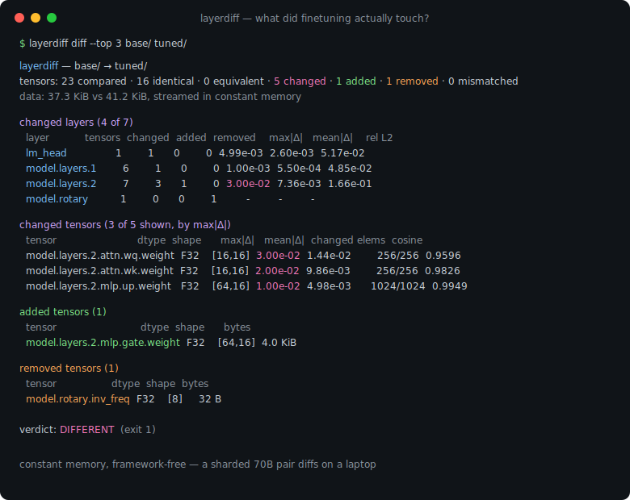
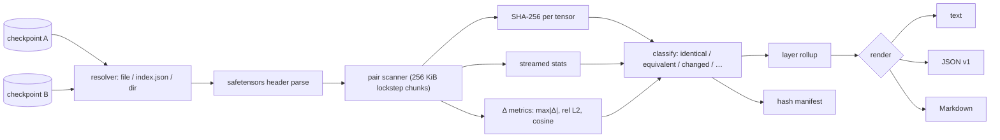

# layerdiff

[English](README.md) | [中文](README.zh.md) | [日本語](README.ja.md)

[](LICENSE) [](go.mod) [](CHANGELOG.md)  [](CONTRIBUTING.md)

**layerdiff：an open-source, zero-dependency CLI that compares two model checkpoints tensor by tensor — streamed hashes, numeric stats, and a changed-layer report, without loading either model.**



```bash
git clone https://github.com/JaydenCJ/layerdiff && cd layerdiff
go build -o layerdiff ./cmd/layerdiff    # single static binary, stdlib only
```

> Pre-release: v0.1.0 is not tagged on a package registry yet; build from source as above (any Go ≥1.22).

## Why layerdiff?

"What did finetuning actually touch?" has no quick answer today. `sha256sum` and `diff` stop at the file level: they tell you *that* a 14 GB checkpoint changed, never *where*. The honest alternative is an ad-hoc Python script that `torch.load`s both checkpoints — a gigabyte-scale framework install, both models in RAM, and twenty lines of tensor bookkeeping you rewrite for every model family. layerdiff reads the safetensors headers directly and streams every tensor through fixed 256 KiB buffers, computing per-tensor SHA-256, statistics, and elementwise difference metrics in one pass per side — so a sharded 70B pair diffs in constant memory on a laptop, no framework installed. The result is the report researchers and merge hobbyists actually want: which layers changed, by how much, what was added or dropped, with `--atol`/`--rtol` to separate real finetuning from conversion noise.

| | layerdiff | sha256sum / diff | ad-hoc PyTorch script | hub file viewers |
|---|---|---|---|---|
| Tensor-level identity (per-tensor hash) | ✅ | ❌ whole-file only | ✅ hand-rolled | ❌ file level |
| Changed-layer rollup | ✅ | ❌ | ❌ DIY | ❌ |
| Numeric Δ metrics (max\|Δ\|, rel L2, cosine) | ✅ | ❌ | ✅ if you write them | ❌ |
| Memory needed | constant (~0.5 MiB buffers) | constant | both models in RAM | n/a |
| Follows sharded `*.index.json` | ✅ | ❌ | manual | ✅ |
| Snapshot now, audit later (hash manifest) | ✅ | ❌ | ❌ | ❌ |
| Exit-code gate with tolerance | ✅ | ✅ bytes only | ❌ | ❌ |
| Runtime dependencies | 0 (static binary) | 0 (built-in) | Python + a framework | n/a (hosted service) |

<sub>Dependency counts checked 2026-07-12: layerdiff imports the Go standard library only; a minimal PyTorch install weighs several GiB on disk before the first tensor is read.</sub>

## Features

- **Constant-memory streaming** — every tensor flows through fixed 256 KiB buffers; hashes, stats, and Δ metrics are folded in one pass per side, so checkpoint size never touches RAM usage.
- **Framework-free** — a single static Go binary reads safetensors directly: single files, `*.safetensors.index.json` sharded weight maps, or directories of loose shards.
- **Tensor-level truth** — SHA-256, min/max/mean/RMS/L2, and zero/NaN/Inf counts per tensor; exact decoders for F32/F64/F16/BF16, all integer widths, and BOOL.
- **Changed-layer report** — tensor names roll up into layers automatically (`model.layers.17.attn.wq.weight → model.layers.17`), so "finetuning touched layers 20–31 and the lm_head" is one glance.
- **Tolerance-aware** — `--atol`/`--rtol` reclassify conversion-noise tensors as *equivalent*, with honest NaN, ±Inf, and negative-zero semantics (documented in [docs/diff-format.md](docs/diff-format.md)).
- **Hash manifests** — `layerdiff hash` snapshots a checkpoint's identity as a small JSON; audit future runs against it without keeping the original weights.
- **Deterministic and scriptable** — POSIX-diff exit codes (0 same, 1 different), stable JSON (`schema_version: 1`), Markdown for PRs, byte-identical output across runs.

## Quickstart

```bash
go run ./examples/make-demo /tmp/layerdiff-demo   # fabricate a base/tuned pair, no framework needed
./layerdiff diff /tmp/layerdiff-demo/base /tmp/layerdiff-demo/tuned
```

Real captured output:

```text
layerdiff — /tmp/layerdiff-demo/base → /tmp/layerdiff-demo/tuned
tensors: 23 compared · 16 identical · 0 equivalent · 5 changed · 1 added · 1 removed · 0 mismatched
data: 37.3 KiB vs 41.2 KiB, streamed in constant memory

changed layers (4 of 7)
  layer           tensors  changed  added  removed    max|Δ|   mean|Δ|    rel L2
  lm_head               1        1      0        0  4.99e-03  2.60e-03  5.17e-02
  model.layers.1        6        1      0        0  1.00e-03  5.50e-04  4.85e-02
  model.layers.2        7        3      1        0  3.00e-02  7.36e-03  1.66e-01
  model.rotary          1        0      0        1         -         -         -

changed tensors (5 of 5 shown, by max|Δ|)
  tensor                         dtype  shape      max|Δ|   mean|Δ|  changed elems  cosine
  model.layers.2.attn.wq.weight  F32    [16,16]  3.00e-02  1.44e-02        256/256  0.9596
  model.layers.2.attn.wk.weight  F32    [16,16]  2.00e-02  9.86e-03        256/256  0.9826
  model.layers.2.mlp.up.weight   F32    [64,16]  1.00e-02  4.98e-03      1024/1024  0.9949
  lm_head.weight                 F32    [32,16]  4.99e-03  2.60e-03        512/512  0.9987
  model.layers.1.norm.weight     F32    [16]     1.00e-03  5.50e-04          16/16  0.9989

added tensors (1)
  tensor                          dtype  shape      bytes
  model.layers.2.mlp.gate.weight  F32    [64,16]  4.0 KiB

removed tensors (1)
  tensor                 dtype  shape  bytes
  model.rotary.inv_freq  F32    [8]     32 B

verdict: DIFFERENT
```

Snapshot a checkpoint today, audit against it after the weights are gone (real output):

```text
$ ./layerdiff hash -o base.json /tmp/layerdiff-demo/base
wrote manifest for 22 tensors to base.json
$ ./layerdiff diff --quiet base.json /tmp/layerdiff-demo/tuned || echo "weights drifted (exit $?)"
weights drifted (exit 1)
```

## CLI reference

`layerdiff [diff|ls|hash|version] …` — `diff` exit codes mirror POSIX diff: 0 no differences, 1 differences found, 2 usage error, 3 runtime error.

| Flag (diff) | Default | Effect |
|---|---|---|
| `--format` | `text` | `text`, `json` (`schema_version: 1`), or `markdown` |
| `--atol` / `--rtol` | `0` / `0` | element counts as changed when \|b−a\| > atol + rtol×\|b\| |
| `--include` / `--exclude` | — | glob on tensor names, repeatable, e.g. `'model.layers.2.*'` |
| `--group-depth` | auto | layer key = first N name segments (auto: first integer segment) |
| `--top` | `20` | changed-tensor rows in text/markdown (0 = all; JSON is never cut) |
| `--hash-only` | off | skip statistics, compare tensor digests only (faster) |
| `--quiet` | off | no output; communicate via exit code |

`ls PATH` inventories one checkpoint (`--hash`, `--stats`, same filters); `hash PATH [-o FILE]` writes the manifest.

## Supported inputs and dtypes

A checkpoint path may be a `.safetensors` file, a `*.safetensors.index.json` sharded index, a directory containing either, or a manifest written by `layerdiff hash`.

| DType | Bytes/elem | Support |
|---|---|---|
| F64, F32, F16, BF16 | 8/4/2/2 | exact decode: full stats + Δ metrics |
| I8–I64, U8–U64, BOOL | 1–8 | full stats + Δ metrics |
| F8_E4M3, F8_E5M2 | 1 | hash + byte identity (no numeric decode in 0.1.0) |
| unknown / future | — | opaque: hash + byte identity, parsing never fails |

## Verification

This repository ships no CI; every claim above is verified by local runs:

```bash
go test ./...            # 90 deterministic tests, offline, < 5 s
bash scripts/smoke.sh    # end-to-end CLI check, prints SMOKE OK
```

## Architecture



## Roadmap

- [x] v0.1.0 — safetensors single/sharded/directory inputs, streamed SHA-256 + stats + Δ metrics, tolerance classes, layer rollup, hash manifests, text/JSON/Markdown, 90 tests + smoke script
- [ ] GGUF reader (quantized blocks hashed per tensor, stats for dequantizable types)
- [ ] PyTorch `.bin`/`.pt` zip reader (weights-only pickle subset)
- [ ] Parallel tensor workers (`--jobs`) for NVMe-bound diffs
- [ ] Numeric decode for FP8 formats
- [ ] Per-tensor weight histograms and an HTML visual report

See the [open issues](https://github.com/JaydenCJ/layerdiff/issues) for the full list.

## Contributing

Issues, discussions and pull requests are welcome — see [CONTRIBUTING.md](CONTRIBUTING.md) for the local workflow (format, vet, tests, `SMOKE OK`). Good entry points are labelled [good first issue](https://github.com/JaydenCJ/layerdiff/issues?q=is%3Aissue+is%3Aopen+label%3A%22good+first+issue%22), and design questions live in [Discussions](https://github.com/JaydenCJ/layerdiff/discussions).

## License

[MIT](LICENSE)
