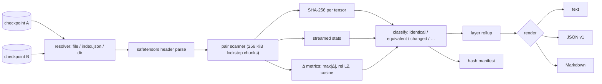

# layerdiff

[English](README.md) | [中文](README.zh.md) | [日本語](README.ja.md)

[](LICENSE) [](go.mod) [](CHANGELOG.md)  [](CONTRIBUTING.md)

**layerdiff：开源、零依赖的 CLI，逐张量对比两个模型 checkpoint —— 流式哈希、数值统计、变更层报告，全程不加载任何模型。**


```bash
git clone https://github.com/JaydenCJ/layerdiff && cd layerdiff
go build -o layerdiff ./cmd/layerdiff    # single static binary, stdlib only
```

> 预发布说明：v0.1.0 尚未发布到任何包仓库；请按上述方式从源码构建（Go ≥1.22 即可）。

## 为什么选 layerdiff？

“微调到底改了哪里？”至今没有快捷答案。`sha256sum` 和 `diff` 止步于文件级：它们只能告诉你一个 14 GB 的 checkpoint *变了*，却永远说不出*哪里变了*。老实的替代方案是写个临时 Python 脚本把两个 checkpoint 都 `torch.load` 进来——GB 级的框架安装、两份模型同时占满内存，外加二十行每换一个模型家族就要重写的张量簿记。layerdiff 直接读取 safetensors 头部，让每个张量流过固定的 256 KiB 缓冲区，单次遍历同时算出逐张量 SHA-256、统计量和逐元素差分指标——于是一对分片 70B 模型在笔记本上以常数内存完成对比，无需安装任何框架。产出正是研究者和模型合并玩家真正想要的报告：哪些层变了、变了多少、加了什么、丢了什么，还有 `--atol`/`--rtol` 把真实微调与格式转换噪声分开。

| | layerdiff | sha256sum / diff | 临时 PyTorch 脚本 | 模型仓库文件页 |
|---|---|---|---|---|
| 张量级身份（逐张量哈希） | ✅ | ❌ 仅整文件 | ✅ 手写 | ❌ 文件级 |
| 变更层汇总 | ✅ | ❌ | ❌ 自己造 | ❌ |
| 数值 Δ 指标（max\|Δ\|、相对 L2、余弦） | ✅ | ❌ | ✅ 前提是你写出来 | ❌ |
| 内存需求 | 常数（约 0.5 MiB 缓冲） | 常数 | 两份模型全进内存 | 不适用 |
| 识别分片 `*.index.json` | ✅ | ❌ | 手动 | ✅ |
| 先快照、日后审计（哈希清单） | ✅ | ❌ | ❌ | ❌ |
| 带容差的退出码门禁 | ✅ | ✅ 仅字节级 | ❌ | ❌ |
| 运行时依赖 | 0（静态二进制） | 0（内置） | Python + 一个框架 | 不适用（托管服务） |

<sub>依赖数核对于 2026-07-12：layerdiff 只 import Go 标准库；最小化的 PyTorch 安装在读到第一个张量之前就要占掉数 GiB 磁盘。</sub>

## 功能特性

- **常数内存流式处理** —— 每个张量流过固定的 256 KiB 缓冲区；哈希、统计和 Δ 指标在每侧单次遍历中同时累积，checkpoint 大小与内存占用彻底解耦。
- **无框架依赖** —— 一个静态 Go 二进制直接读取 safetensors：单文件、`*.safetensors.index.json` 分片权重表，或存放散装分片的目录。
- **张量级真相** —— 逐张量 SHA-256、min/max/mean/RMS/L2、零/NaN/Inf 计数；F32/F64/F16/BF16、全部整数宽度及 BOOL 均为精确解码。
- **变更层报告** —— 张量名自动归并为层（`model.layers.17.attn.wq.weight → model.layers.17`），“微调动了第 20–31 层和 lm_head”一眼可见。
- **容差感知** —— `--atol`/`--rtol` 把转换噪声张量重新归类为*等价*，NaN、±Inf、负零语义严谨（详见 [docs/diff-format.md](docs/diff-format.md)）。
- **哈希清单** —— `layerdiff hash` 把 checkpoint 的身份快照成一个小 JSON；日后无需保留原始权重即可审计新的产出。
- **确定性、可脚本化** —— POSIX diff 式退出码（0 相同，1 有差异）、稳定 JSON（`schema_version: 1`）、可贴进 PR 的 Markdown，跨机器逐字节一致的输出。

## 快速上手

```bash
go run ./examples/make-demo /tmp/layerdiff-demo   # fabricate a base/tuned pair, no framework needed
./layerdiff diff /tmp/layerdiff-demo/base /tmp/layerdiff-demo/tuned
```

真实抓取的输出：

```text
layerdiff — /tmp/layerdiff-demo/base → /tmp/layerdiff-demo/tuned
tensors: 23 compared · 16 identical · 0 equivalent · 5 changed · 1 added · 1 removed · 0 mismatched
data: 37.3 KiB vs 41.2 KiB, streamed in constant memory

changed layers (4 of 7)
  layer           tensors  changed  added  removed    max|Δ|   mean|Δ|    rel L2
  lm_head               1        1      0        0  4.99e-03  2.60e-03  5.17e-02
  model.layers.1        6        1      0        0  1.00e-03  5.50e-04  4.85e-02
  model.layers.2        7        3      1        0  3.00e-02  7.36e-03  1.66e-01
  model.rotary          1        0      0        1         -         -         -

changed tensors (5 of 5 shown, by max|Δ|)
  tensor                         dtype  shape      max|Δ|   mean|Δ|  changed elems  cosine
  model.layers.2.attn.wq.weight  F32    [16,16]  3.00e-02  1.44e-02        256/256  0.9596
  model.layers.2.attn.wk.weight  F32    [16,16]  2.00e-02  9.86e-03        256/256  0.9826
  model.layers.2.mlp.up.weight   F32    [64,16]  1.00e-02  4.98e-03      1024/1024  0.9949
  lm_head.weight                 F32    [32,16]  4.99e-03  2.60e-03        512/512  0.9987
  model.layers.1.norm.weight     F32    [16]     1.00e-03  5.50e-04          16/16  0.9989

added tensors (1)
  tensor                          dtype  shape      bytes
  model.layers.2.mlp.gate.weight  F32    [64,16]  4.0 KiB

removed tensors (1)
  tensor                 dtype  shape  bytes
  model.rotary.inv_freq  F32    [8]     32 B

verdict: DIFFERENT
```

今天先给 checkpoint 拍快照，等权重删掉之后照样能审计（真实输出）：

```text
$ ./layerdiff hash -o base.json /tmp/layerdiff-demo/base
wrote manifest for 22 tensors to base.json
$ ./layerdiff diff --quiet base.json /tmp/layerdiff-demo/tuned || echo "weights drifted (exit $?)"
weights drifted (exit 1)
```

## CLI 参考

`layerdiff [diff|ls|hash|version] …` —— `diff` 的退出码沿用 POSIX diff：0 无差异，1 有差异，2 用法错误，3 运行时错误。

| 标志（diff） | 默认值 | 作用 |
|---|---|---|
| `--format` | `text` | `text`、`json`（`schema_version: 1`）或 `markdown` |
| `--atol` / `--rtol` | `0` / `0` | 当 \|b−a\| > atol + rtol×\|b\| 时元素计为已变更 |
| `--include` / `--exclude` | — | 按张量名 glob 过滤，可重复，如 `'model.layers.2.*'` |
| `--group-depth` | 自动 | 层键 = 名称前 N 段（自动模式：到第一个整数段为止） |
| `--top` | `20` | text/markdown 中变更张量的行数上限（0 = 全部；JSON 永不截断） |
| `--hash-only` | 关 | 跳过统计，只比对张量摘要（更快） |
| `--quiet` | 关 | 不输出任何内容，只用退出码交流 |

`ls PATH` 清点单个 checkpoint（`--hash`、`--stats`，过滤器相同）；`hash PATH [-o FILE]` 写出清单。

## 支持的输入与 dtype

checkpoint 路径可以是 `.safetensors` 文件、`*.safetensors.index.json` 分片索引、包含二者之一的目录，或 `layerdiff hash` 写出的清单。

| DType | 字节/元素 | 支持程度 |
|---|---|---|
| F64、F32、F16、BF16 | 8/4/2/2 | 精确解码：完整统计 + Δ 指标 |
| I8–I64、U8–U64、BOOL | 1–8 | 完整统计 + Δ 指标 |
| F8_E4M3、F8_E5M2 | 1 | 哈希 + 字节级同一性（0.1.0 不做数值解码） |
| 未知 / 未来类型 | — | 不透明：哈希 + 字节级同一性，解析永不失败 |

## 验证

本仓库不带任何 CI；上述每一条声明都由本地运行验证：

```bash
go test ./...            # 90 deterministic tests, offline, < 5 s
bash scripts/smoke.sh    # end-to-end CLI check, prints SMOKE OK
```

## 架构



## 路线图

- [x] v0.1.0 —— safetensors 单文件/分片/目录输入、流式 SHA-256 + 统计 + Δ 指标、容差分类、层级汇总、哈希清单、text/JSON/Markdown 输出、90 个测试 + smoke 脚本
- [ ] GGUF 读取器（量化块按张量哈希，可反量化类型附带统计）
- [ ] PyTorch `.bin`/`.pt` zip 读取器（仅权重的 pickle 子集）
- [ ] 并行张量 worker（`--jobs`），榨干 NVMe 带宽
- [ ] FP8 格式的数值解码
- [ ] 逐张量权重直方图与 HTML 可视化报告

完整列表见 [open issues](https://github.com/JaydenCJ/layerdiff/issues)。

## 参与贡献

欢迎 issue、讨论与 PR —— 本地工作流（格式化、vet、测试、`SMOKE OK`）见 [CONTRIBUTING.md](CONTRIBUTING.md)。入门任务标注为 [good first issue](https://github.com/JaydenCJ/layerdiff/issues?q=is%3Aissue+is%3Aopen+label%3A%22good+first+issue%22)，设计讨论请移步 [Discussions](https://github.com/JaydenCJ/layerdiff/discussions)。

## 许可证

[MIT](LICENSE)
